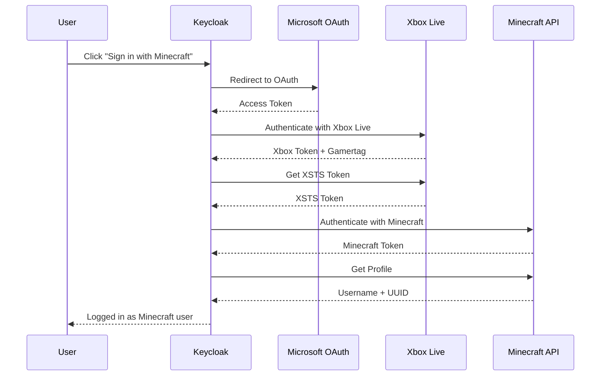

# Keycloak Minecraft Identity Provider

[](https://github.com/groundsgg/keycloak-minecraft/actions/workflows/build.yml)
[](https://www.keycloak.org/)
[](https://adoptium.net/)

A Keycloak Identity Provider plugin that enables authentication via Microsoft/Xbox OAuth2 and stores the Minecraft player name as the primary username.

## Features

- **Minecraft Java Edition Support** - Authenticate players with their Minecraft Java Edition account
- **Bedrock Edition Fallback** - Players without Java Edition can use their Xbox Gamertag
- **Automatic Username Sync** - Keycloak username is automatically set to the Minecraft player name
- **Rich User Attributes** - Stores Minecraft UUID, edition type, and Xbox Gamertag
- **Seamless Integration** - Works like any other Keycloak Identity Provider

## Compatibility

| Plugin Version | Keycloak Version | Java Version |
|----------------|------------------|--------------|
| 1.x            | 25.x             | 17+          |

## Quick Start

### Download

Download the latest JAR from the [Releases](https://github.com/groundsgg/keycloak-minecraft/releases) page.

Or build from source:

```bash
mvn clean package
```

### Installation

1. Copy the JAR to your Keycloak providers directory:

```bash
cp keycloak-minecraft.jar /opt/keycloak/providers/
```

2. Rebuild Keycloak:

```bash
/opt/keycloak/bin/kc.sh build
```

3. Restart Keycloak

## How It Works



## Prerequisites

### Azure App Registration

You need a Microsoft Azure App Registration:

1. Go to [Azure Portal](https://portal.azure.com/) → "App registrations"
2. Create a new App Registration
3. Configure:
   - **Redirect URI**: `https://your-keycloak-url/realms/{realm}/broker/minecraft/endpoint`
   - **API Permissions**: Add `XboxLive.signin` (delegated)
4. Create a Client Secret under "Certificates & secrets"

## Configuration in Keycloak

1. Go to your Realm → Identity Providers
2. Click "Add provider" → "Minecraft"
3. Configure:
   - **Client ID**: The Application (client) ID from your Azure App
   - **Client Secret**: The Client Secret from your Azure App

## User Attributes

After successful authentication, the following attributes are stored:

| Attribute | Description |
|-----------|-------------|
| `username` | Minecraft player name or Xbox Gamertag (primary Keycloak username) |
| `minecraft_username` | The Minecraft player name or Xbox Gamertag |
| `minecraft_edition` | `java` or `bedrock` - which edition the player owns |
| `minecraft_uuid` | The Minecraft UUID (only for Java Edition) |
| `xbox_gamertag` | The player's Xbox Gamertag |
| `xbox_user_id` | The Xbox User ID (if available) |

### Java Edition vs. Bedrock Edition

- **Java Edition**: Players with Minecraft Java Edition get their Java player name and UUID
- **Bedrock Edition**: Players without Java Edition (Bedrock only) get their Xbox Gamertag as username

## Local Development

```bash
# Build the plugin
mvn clean package

# Start Docker container
cd docker
docker-compose up -d
```

Keycloak will be available at http://localhost:8080.
- **Admin Username**: admin
- **Admin Password**: admin

## Troubleshooting

### "This Microsoft account does not own Minecraft Java Edition"

The user doesn't have Minecraft Java Edition on their Microsoft account. They will be authenticated with their Xbox Gamertag instead.

### Xbox Live Errors

| Error Code | Meaning |
|------------|---------|
| 2148916233 | Microsoft account doesn't have an Xbox account |
| 2148916235 | Xbox Live is not available in the user's country |
| 2148916238 | Child account - needs to be added to a family |

## Contributing

Contributions are welcome! Please feel free to submit a Pull Request.

1. Fork the repository
2. Create your feature branch (`git checkout -b feature/amazing-feature`)
3. Commit your changes (`git commit -m 'Add some amazing feature'`)
4. Push to the branch (`git push origin feature/amazing-feature`)
5. Open a Pull Request

## Acknowledgments

- [Keycloak](https://www.keycloak.org/) - Open Source Identity and Access Management
- [Minecraft Authentication Documentation](https://minecraft.wiki/w/Microsoft_authentication) - Community documentation of the auth flow
